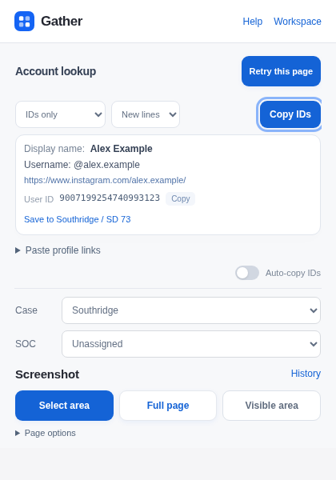
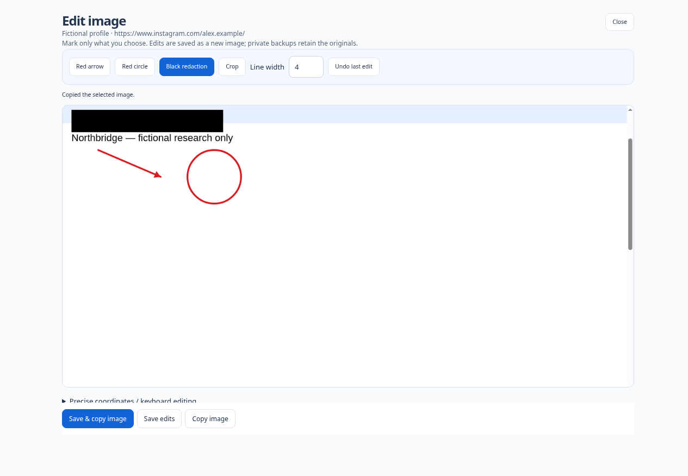

  

<h1 align="center">Gather</h1>

Account lookup. Screenshots. Organized research.

  <strong><a href="https://github.com/roedoeroe/Gather/releases/download/1.8.15-rc.1/Gather-1.8.15-extension.zip">Download Gather 1.8.15 RC</a></strong>
  · <a href="#install-or-update">Install or update</a>
  · <a href="https://github.com/roedoeroe/Gather/releases/tag/1.8.15-rc.1">Release notes</a>

Gather is a local browser extension that takes the repetitive work out of research. **Open a profile → Gather → inspect or copy.** Start immediately; a case is optional.

- **Look up accounts.** Find and copy exact platform IDs from Instagram, Facebook, Threads, TikTok and YouTube.
- **Capture what matters.** Select an area, scroll to extend it, or capture the visible/full page. Copy the image or edit it with crop, arrows, circles and manual black redactions.
- **Keep work together.** Save chosen findings and captures to a Case/SOC. Resume in a workspace organized into Research, Captures, Case and Settings.

  
   Actual Gather interface with fictional demonstration data.

See the image editor

Edits are saved separately from the original. Choose what to mark, review the result, then copy or save it.

## Install or update

**You only need the extension ZIP.**

1. [Download Gather](https://github.com/roedoeroe/Gather/releases/download/1.8.15-rc.1/Gather-1.8.15-extension.zip) and extract the ZIP into a permanent folder.
2. In Edge, open `edge://extensions`, enable **Developer mode**, choose **Load unpacked**, and select **account-id-tool**. Your organization must allow unpacked extensions.
3. Pin Gather in the browser toolbar, open a supported profile, and click Gather. **Help** is available in the popup, side panel and workspace.

**Already using Gather?** Finish captures and close Gather windows. Replace all files in the **same installed account-id-tool folder**, then click **Reload** at `edge://extensions`. Confirm **1.8.15**. Do not uninstall or clear storage to update. Keep the previous version and a matching private backup for rollback testing in a separate browser profile.

[Quick Start — read online](https://github.com/roedoeroe/Gather/blob/e718086513f61d2889498d843a7ba9cf39ecd2b5/gather/account-id-tool/COWORKER-QUICK-START.md) · [Detailed product guide](https://github.com/roedoeroe/Gather/blob/e718086513f61d2889498d843a7ba9cf39ecd2b5/gather/README.md)

## Your work stays local

Cases, subjects, findings and images stay in this browser profile on your computer. Gather has **no case-data cloud sync or analytics**. Deliberate lookups and searches contact the selected platform or provider; Gather does not retain automatic web-search queries.

Copying and exporting create copies outside Gather. Red deletion controls remove local Gather records, not downloaded files or browser/clipboard history. Image redaction is manual; private backups are unencrypted and can contain original, unredacted images.

## Current release

**1.8.15 is a release candidate for a small coworker pilot.** It adds a conditional two-second wait for late Instagram metadata and shared searchable Help. Already available IDs return immediately.

The build passed **214 Node tests, 116 rendered workflow groups and 36 installed Linux Edge groups**, plus worker, reader and pixel checks. Native capture, scrolling selection, cancellation, clipboard, editing and in-place update were tested. Signed-in Windows Edge, native zoom/DPI, native side-panel opening and OS save/print dialogs still need pilot verification.

[Full test evidence](https://github.com/roedoeroe/Gather/blob/e718086513f61d2889498d843a7ba9cf39ecd2b5/gather/docs/TESTING.md) · [Known limitations](https://github.com/roedoeroe/Gather/blob/e718086513f61d2889498d843a7ba9cf39ecd2b5/gather/docs/RELEASE-CANDIDATE-1.8.15.md) · [Report a reproducible bug](https://github.com/roedoeroe/Gather/issues/new?template=bug-report.yml)

For developers and contributors

The default `main` branch contains the 1.8.15 release-candidate source. Development continues on [`develop/1.8.0-r3`](https://github.com/roedoeroe/Gather/tree/develop/1.8.0-r3); the branch name is historical. Use the immutable [`1.8.15-rc.1` tag](https://github.com/roedoeroe/Gather/tree/1.8.15-rc.1) to reproduce the published download.

The runtime is in `gather/account-id-tool`, with no bundler, hosted server or runtime install step. See [Contributing](CONTRIBUTING.md) for test commands and repository layout, and [Security](SECURITY.md) for handling reports without exposing real case data.

[Source/test package and integrity receipts](https://github.com/roedoeroe/Gather/tree/e718086513f61d2889498d843a7ba9cf39ecd2b5/releases/1.8.15) · [Product direction](https://github.com/roedoeroe/Gather/blob/e718086513f61d2889498d843a7ba9cf39ecd2b5/gather/docs/R4-WORKFLOW-RECONCILIATION.md)

